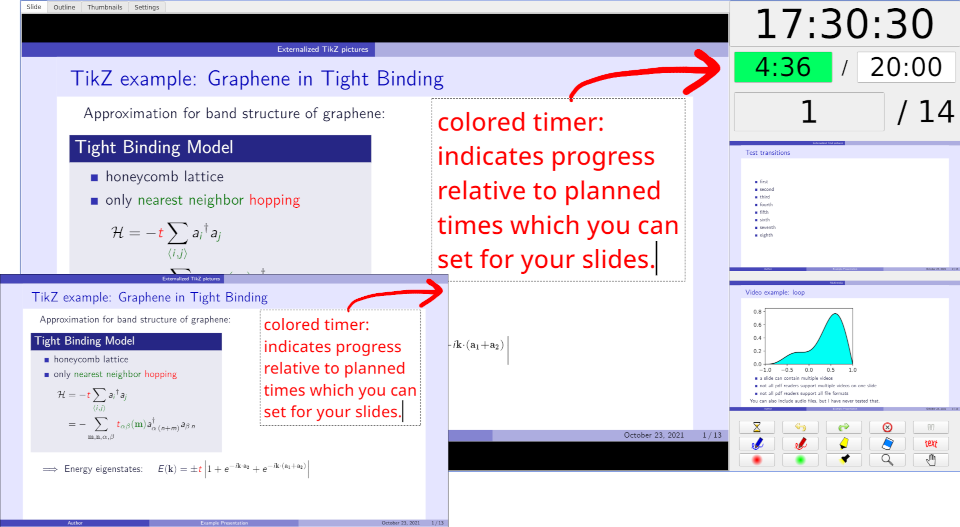
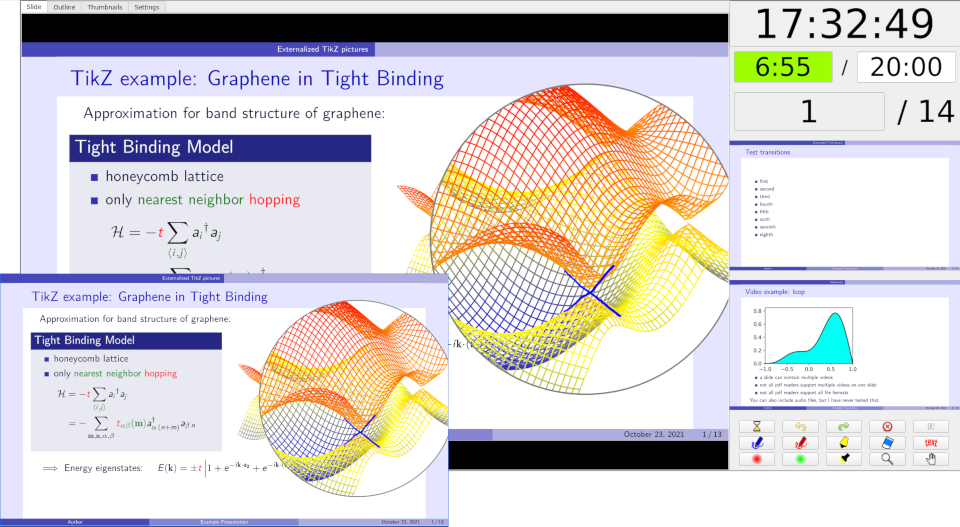
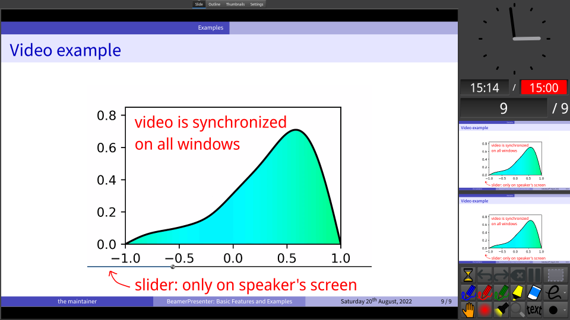

# BeamerPresenter
BeamerPresenter is a PDF viewer for presentations, which opens a presentation
screen and a control screen in two different windows. The control screen
optionally shows slides from a dedicated notes document instead of the slides
for the audience. Additional information on the control screen includes a
clock, a timer for the presentation, and previews of the next slides.

This software uses the Qt framework and the PDF engines MuPDF and/or poppler.

## Features (selection)
* modular user interface: adapt for your presentation style and technical equipment (number of monitors, extra information for the speaker, input devices, ...)
* compressed cache for fast slide changes
* draw in slides, save drawings in a format compatible with Xournal++
* highlighting tools (pointer, torch, magnifier)
* rich text notes for the speaker
* (optionally) show separate presentation file for speaker or use LaTeX-beamer's option to show notes on second screen (split PDF pages into a part for the speaker and a part or the audience)
* timer indicates progress relative to a predefined schedule by it's color
* navigate using document outline, thumbnail slides, page numbers/labels and links
* videos in presentations (currently sound is untested)
* slide transitions


## Screenshots
These screenshots only show one possible way of using BeamerPresenter. The speaker could also see a different presentation (with additional information) or editable notes.

<table border="0px" >
<tr>
<td width=50%>
One possible configuration of the graphical interface shows the previews of the last overlays of the current and next slide to the speaker:

The small window in this image is the presentation window that is usually shown on a projector.
</td>
<td>
A timer shows your current progress. When you have a tight schedule you can plan times for some slides and the color of the timer will indicate your progress relative to these planned times.

The annotations on this slide (red text and arrow) were also made directly in BeamerPresenter.
Annotations can be saved in a format that is compatible with Xournal++.
</td>
</tr>
<tr>
<td>
Different highlighting tool, including magnifier, torch and pointer, can be used to draw attention to parts of your slide.

</td>
<td>
PDF documents can include videos, sounds, slide transitions and some primitive animations. These features are partially supported by BeamerPresenter.

</td>
</tr>
</table>


## Build and install
Building is tested in Arch Linux and in xubuntu 20.04.
Older versions of ubuntu are only compatible with version 0.1 of BeamerPresenter which is described
[here](https://github.com/stiglers-eponym/BeamerPresenter/tree/0.1.x#build).

In Arch Linux you can install the Qt 5 version as package `beamerpresenter` or `beamerpresenter-git` from the AUR.
(Globally replace qt5 by qt6 in PKGBUILD of the git version to build it with Qt 6.)
Note that in these packages by default MuPDF is selected as PDF engine.

First install the dependencies.
You need Qt 5/6 including the multimedia module.
In Qt 5 versions since 5.12 are tested, but other versions starting from 5.9 should also be supported. For installation in Qt 6 you need version 6.2 (or later).
Additionally you need either the Qt 5/6 bindings of poppler or the MuPDF C bindings.

### Dependencies in Ubuntu 20.04
For Qt 5:
* `qt5-qmake`
* `qt5-default`
* `qtmultimedia5-dev`
* `libqt5multimedia5-plugins` (optional, for showing videos)

For poppler (optional, see [below](https://github.com/stiglers-eponym/BeamerPresenter#build)):
* `libpoppler-qt5-dev`: version 0.86.1 is tested. Versions below 0.70 are explicitly not supported, problems with newer versions might be fixed if reported in an issue on github.

For MuPDF (optional, see [below](https://github.com/stiglers-eponym/BeamerPresenter#build)):
* `libmupdf-dev` (only for building): Tested versions: 1.16.1 - 1.19.0.
* `libfreetype-dev`
* `libharfbuzz-dev`
* `libjpeg-dev`
* `libopenjp2-7-dev`
* `libjbig2dec0-dev`
* `libgumbo-dev` (for MuPDF >=1.18, probably not for version <=1.17)

Others:
* `zlib1g-dev`

### Dependencies in Arch Linux
Replace qt5 by qt6 in all package names if you want to use Qt 6.

For Qt 5:
* `qt5-multimedia` (depends on `qt5-base`, which is also required)
* optional: `qt5-svg` for showing icons

For poppler (optional, see [below](https://github.com/stiglers-eponym/BeamerPresenter#build)):
* `poppler-qt5`

For MuPDF (optional, see [below](https://github.com/stiglers-eponym/BeamerPresenter#build)):
* `libmupdf` (only for building, tested versions: 1.16.1 - 1.19.0)
* `jbig2dec`
* `openjpeg2`
* `gumbo-parser`

Optional, for showing videos:
* `gst-libav`
* `gst-plugins-good`

### Build
Download the sources: either the latest git version
```sh
git clone --depth 1 --single-branch https://github.com/stiglers-eponym/BeamerPresenter.git
cd BeamerPresenter
```
or version 0.2.1
```sh
wget https://github.com/stiglers-eponym/BeamerPresenter/archive/v0.2.1.tar.gz
sha256sum -c - <<< "3876bea71907aa64766cff6f7da6fd3bb50a89325e8dba64618a594e1749ed42 v0.2.1.tar.gz"
tar -xf v0.2.1.tar.gz
cd BeamerPresenter-0.2.1
```
On systems other than GNU+Linux you now need to configure libraries in
`beamerpresenter.pro`. Pull requests or issues with build instructions for
other systems are welcome!

When building you need to **define the PDF engine**.
Build with one of the following commands: (for Qt 6 you might need to replace `qmake` by `qmake6`)
```sh
qmake RENDERER=mupdf && make
qmake RENDERER=poppler && make
```
To build with debug information you can add `CONFIG+=debug` as an arguments to qmake.
If this fails and you have all dependencies installed, you should check your
Qt version (`qmake --version`) and
[open an issue](https://github.com/stiglers-eponym/BeamerPresenter/issues)
on github.
In older versions you may also open an issue, but it will probably not be fixed.

### Install
In GNU+Linux you can install BeamerPresenter with
```sh
make install
```


## Bugs
If you find bugs or have suggestions for improvements, please
[open an issue](https://github.com/stiglers-eponym/BeamerPresenter/issues).

When reporting bugs, please include the version string of BeamerPresenter
(`beamerpresenter --version`) or the Qt version if you have problems building
BeamerPresenter (`qmake --version`).

It can also be very helpful to have some debug information when you report program crashs. To build BeamerPresenter with debug information, use (for MuPDF):
```sh
qmake CONFIG+=debug RENDERER=mupdf && make
```


## Development

### Known problems
#### Multimedia
* Video performance is bad in the following situations:
    * when you draw or erase on a slide while a video is played (drawing one long stroke is much worse than many short strokes)
    * when you use the magnifier or torch while a video is played when there are also drawings on the same slide. The magnifier generally has rather limited performance when used on a slide that contains drawings.
    * when using multiple magnifiers (yes, that's possible, but you shouldn't do it)
* Sound links in PDFs are unsupported in the MuPDF version. They should work with Poppler.
* Embedded sounds are unsupported, only links to external files can be played.
#### User interface
* Tool buttons can be changed in the user interface, but these changes are not saved. Buttons are part of the user interface, which can only be changed (permanently) by editing the JSON-formatted configuration file.
#### Drawing/annotating
* fixed in current git version: undo after clearing a text field may lead to a crash of the program.
* The undo/redo actions do not handle text annotations correctly. They only remove or create text fields. But when editing a text field the default keyboard shortcuts (CTRL+Z and CTRL+SHIFT+Z) can be used to undo/redo changes in the text. Deleting a text field by deleting its entire text cannot be undone.
* The detection of unsaved changes is quite unreliable. When closing BeamerPresenter you may sometimes see a warning of possibly unsaved changes although there are no unsaved changes. This warning is currently not shown when closing the window through the window manager. The warning can be avoided by using the action "quit unsafe" instead of "quit".
#### Slide transitions
* Sometimes the slides are not automatically rendered to the correct size when resizing the window. Changing or updating the page should solve this problem.
* Some slide transitions need to stop videos. Fly slide transitions during videos can cause strange effects.
* If a preview shows specific overlays, slide changes adding or removing synchronization of this preview with an another widget may lead to short flickering. Slide transitions during such slide changes can contain some ugly artifacts.
#### Backend
* When compiling with both MuPDF and poppler (`qmake RENDERER=both`), trying to open a PDF with renderer=poppler can result in a segmentation fault for some PDFs (when loading the document or when reaching a certain page). The reason might be a linkage problem with some color-space functions. It is recommended to compile with only one PDF engine.
* The program might crash randomly when resizing windows while quickly changing slides including slides that contain videos or fly transitions. This is currently considered a rarely occurring and not easily reproducible issue.
* Some effects (animations, slide transitions) might not work as expected if (at least) one window showing the slide is currently hidden and not updated by the window manager.
* Fixed in MuPDF 1.19: Slide labels are broken for encrypted PDFs when using MuPDF.


### Ideas for further development
* tools to select and modify drawings
* improve cache management and layout corrections: sometimes cache is not used correctly.
* cache slides even when size of slides varies (partially implemented)
* cache only required slides in previews showing specific overlays
* make layout more reliable
* option to insert extra slides for drawing
* improve keyboard shortcuts in other widgets than slide widget
* more icons for actions


## License
This software may be redistributed and/or modified under the terms of the GNU Affero General Public License (AGPL), version 3, available on the [GNU web site](https://www.gnu.org/licenses/agpl-3.0.html). This license is chosen in order to ensure compatibility with the software libraries used by BeamerPresenter, including Qt, MuPDF, and poppler.

BeamerPresenter can be compiled without including MuPDF, using only poppler as a PDF engine.
Those parts of the software which can be used without linking to MuPDF may, alternatively to the AGPL, be redistributed and/or modified under the terms of the GNU General Public License (GPL), version 3 or any later version, available on the [GNU web site](https://www.gnu.org/licenses/gpl-3.0.html).

BeamerPresenter is distributed in the hope that it will be useful,
but WITHOUT ANY WARRANTY; without even the implied warranty of
MERCHANTABILITY or FITNESS FOR A PARTICULAR PURPOSE. See the
GNU General Public License for more details.
