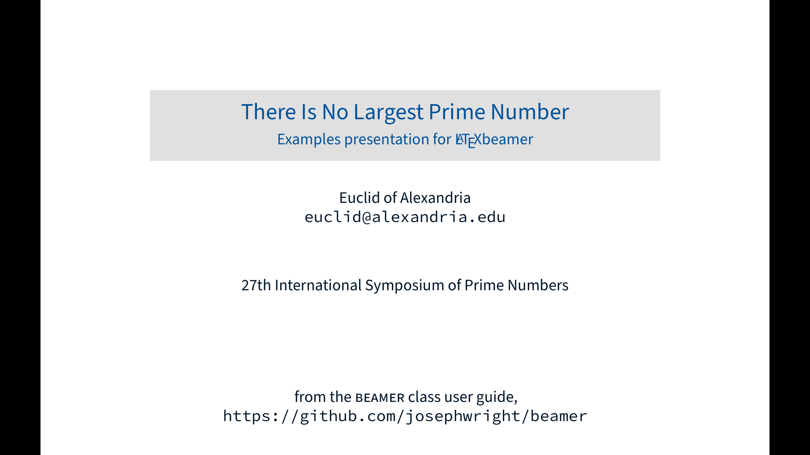
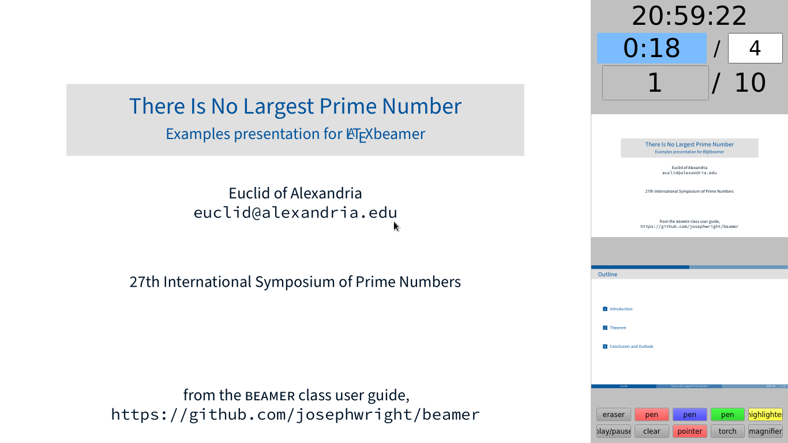
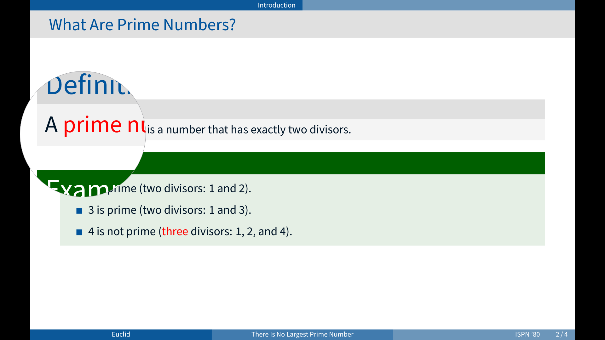
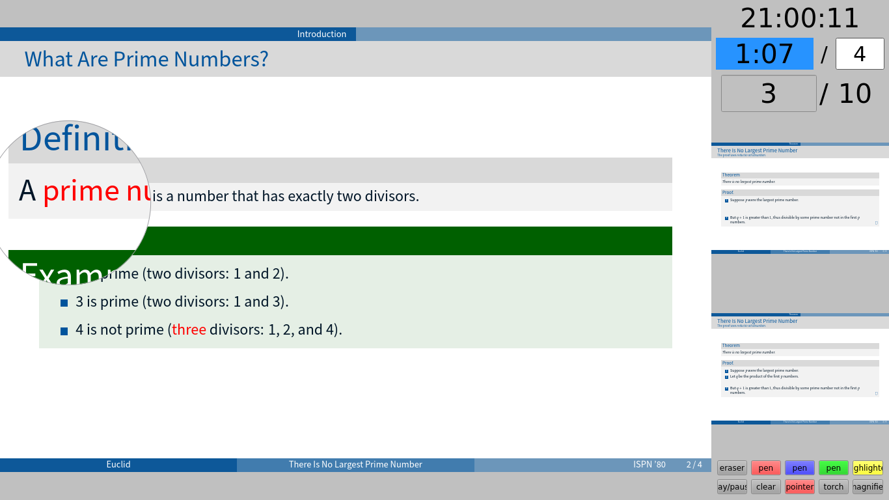
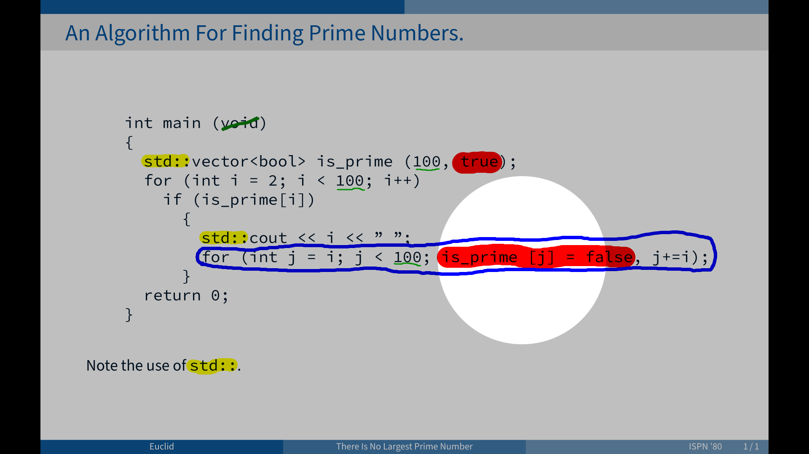
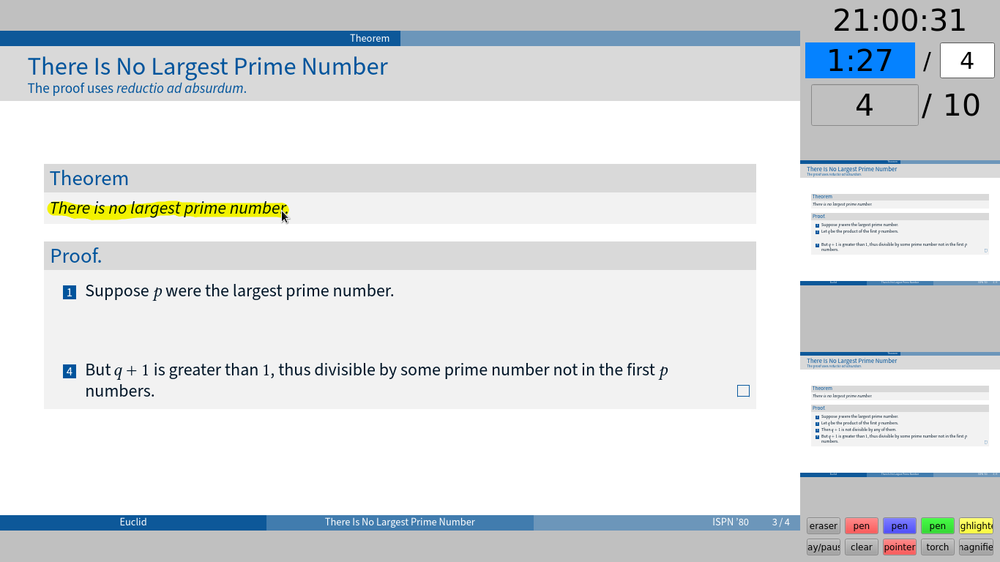
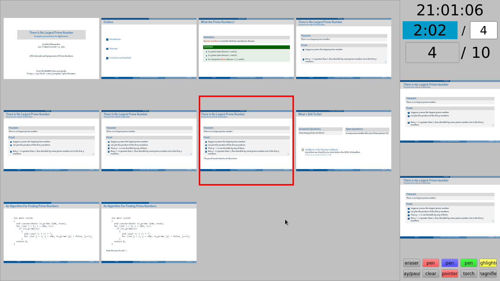
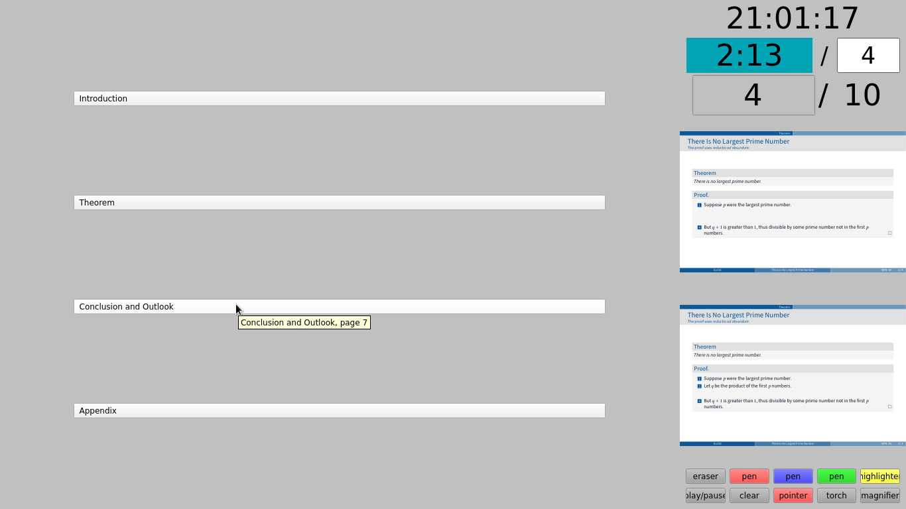

# BeamerPresenter
BeamerPresenter is a PDF viewer for presentations, which opens a presentation
screen and a control screen in two different windows. The control screen
optionally shows slides from a dedicated notes document instead of the slides
for the audience. Additional information on the control screen includes the
current time, a timer for the presentation, and previews of the next slides.

Features include slide transitions, multimedia content, different options for
efficient and fast navigation, and different tools for highlighting and drawing
in the presentation.

Based on Qt, BeamerPresenter is cross-platform, but mainly tested on
Arch Linux with X11 or wayland using presentations created by LaTeX beamer.
In general Qt programs more stable in X11 than in wayland.

## Upcoming changes
The default branch of this repository will soon be changed to what is currently
the `rewrite` branch. This branch (`master`) will be renamed to `0.1.x`.
The new version 0.2.x is incompatible with the configuration files and drawing
file types of the old version 0.1.x.
Not all features of 0.1.x will be available in 0.2.x.
In the beginning, slide transitions and multimedia content will not be
supported by 0.2.x.

## Features
An extended list of features can be found in the manual (`beamerpresenter.1`).

*   Speaker screen showing notes, previews of the current and next slide, a
    timer, a clock and the current slide number.

<table border="0px"><tr><td>

</td><td>

</td></tr></table>

*   Draw in presentation: You can use different pens and highlighters to draw
    in the presentation. Drawings are synchronized between notes screen and
    presentation screen. You can use a pointer, torch and magnifier to
    highlight parts of the presentation.
    Drawings can be saved to an experimental binary file format.

<table border="0px"><tr><td>

</td><td>

</td></tr>
<tr><td>

</td><td>

</td></tr></table>

*   Simple navigation by using links, scrolling, a table of contents, an
    overview of all slides on the speaker's screen, and shortcuts for skipping
    overlays.

<table border="0px"><tr><td>

</td><td>

</td></tr></table>

*   The timer can be configured to change its color as to indicate whether you
    are in time.
*   Cache: All slides are rendered to a compressed cache.
    The total cache size and the number of slides in cache can be limited.
*   Slide transitions: BeamerPresenter probably supports probably all slide
    transitions    which are defined in the PDF standard.
*   Multimedia: You can add videos and audio files to your presentation.
    A video will continue playing if embedded on two consecutive slides with
    the same page label (overlays in LaTeX beamer).
*   Animations: You can create simple animations by showing slides in rapid
    succession. The minimal delay between two frames can be defined in the
    configuration.


## Build
To build and use this project you need to have the Qt5 multimedia module and the
poppler Qt5 bindings installed. Building with Qt6 is not possible.
If building fails on your system, please open an issue on github and mention
your Qt version (`qmake --version`).

Download, compile and install this project on GNU/Linux systems:
```sh
git clone https://github.com/stiglers-eponym/BeamerPresenter.git
cd BeamerPresenter
qmake && make
make install
```
In GNU/Linux showing videos in a presentation additionally requires the
installation of some GStreamer plugins.
In other systems other plugins might be needed.


### Installation in Arch Linux
You can install the package `beamerpresenter` or `beamerpresenter-git` from the AUR.


### Installation in Ubuntu >= 18.04
First install the dependences (note that this changes the default Qt version to Qt5):
```sh
sudo apt install g++ qt5-qmake qt5-default libpoppler-qt5-dev qtmultimedia5-dev
```
Optionally install `libqt5multimedia5-plugins` for multimedia content.

Then download the source and build. To download the latest release use
```sh
wget https://github.com/stiglers-eponym/BeamerPresenter/archive/v0.1.3.tar.gz
tar -xf v0.1.3.tar.gz
cd BeamerPresenter-0.1.3
qmake && make
```
To build from current git version use
```sh
git clone https://github.com/stiglers-eponym/BeamerPresenter.git
cd BeamerPresenter
qmake && make
```
You could now install BeamerPresenter using `sudo make install`, but it is
recommended to use `checkinstall` in order to keep track of all installed files
using dpkg or apt:
```sh
sudo apt install checkinstall
echo 'Simple dual screen pdf presentation tool' > description-pak
sudo checkinstall -D \
    --pkglicense=GPL3 \
    --requires=libpoppler-qt5-1,libqt5multimediawidgets5 \
    --pkgsource=github.com/stiglers-eponym/BeamerPresenter \
    make install
```

After the installation you can remove the packages `libpoppler-qt5-dev`,
`qtmultimedia5-dev`, `libpoppler-dev` and `checkinstall`.


### Building in macOS

First install the dependencies via [Homebrew package manager](https://brew.sh):
```sh
brew install qt poppler
```

Then download the source and build as described for ubuntu.
For the latest git version use
```sh
git clone https://github.com/stiglers-eponym/BeamerPresenter.git
cd BeamerPresenter
qmake && make
```

Installation is currently not supported but opening the application can be done
via command:
```sh
open beamerpresenter.app/Contents/MacOS/beamerpresenter
```
from the directory where it was built.


### Other OS
For building BeamerPresenter in any other OS you need to have Qt5 and the
poppler-qt5 library installed. In `beamerpresenter.pro` you need to configure
`INCLUDEPATH` and `LIBS` manually.

On Microsoft Windows you can either use the Windows Subsystem for Linux or
build directly in Windows. Using the subsystem for linux has the advantage
that you can use recent poppler versions provided by e.g. ubuntu. But it
requires manual configuration of the display.
When building directly in Windows you need poppler and Qt5 for Windows.


## Usage
```sh
beamerpresenter [options] <presentation.pdf> [<notes.pdf>]
```
For more options and usage possibilities use `beamerpresenter --help` and the
man pages.

If you start `beamerpresenter` without any arguments, it will show a file dialog
in which you can pick you presentation and notes file.


## Settings
Settings can be placed in a file `beamerpresenter.conf` (on platforms other than
GNU/Linux: `beamerpresenter.ini`). An example configuration file is provided.
The configuration can only be edited directly with a text editor.


## Bugs
If you find bugs or have suggestions for improvements, please
[open an issue](https://github.com/stiglers-eponym/BeamerPresenter/issues).

When reporting bugs, please include the version string of BeamerPresenter
(`beamerpresenter --version`) or the Qt version if you have problems building
BeamerPresenter (`qmake --version`).


## Development
The code for versions 0.1.x is quite unreadable, not really structured and full
of ugly bug-fixes. To create something more structured, efficient, modular and
flexible, I started rewriting BeamerPresenter from scratch (branch `rewrite`).

For the old code this means: Small issues might still be fixed, but new
features will only be available in the new, rewritten version.

Some features available the new version: modular user interface,
drawing history, pressure-sensitive tablet input, flexible pdf engine (MuPDF or
poppler), markdown-formatted notes, improved multi-threading.
