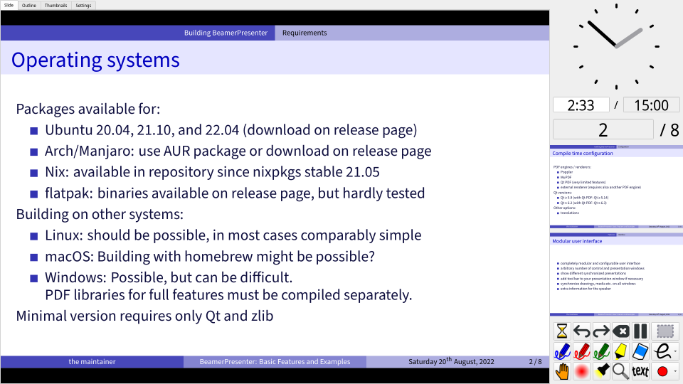
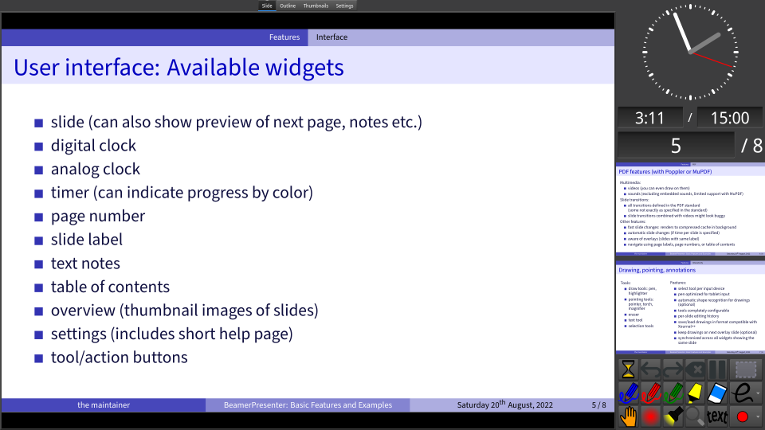
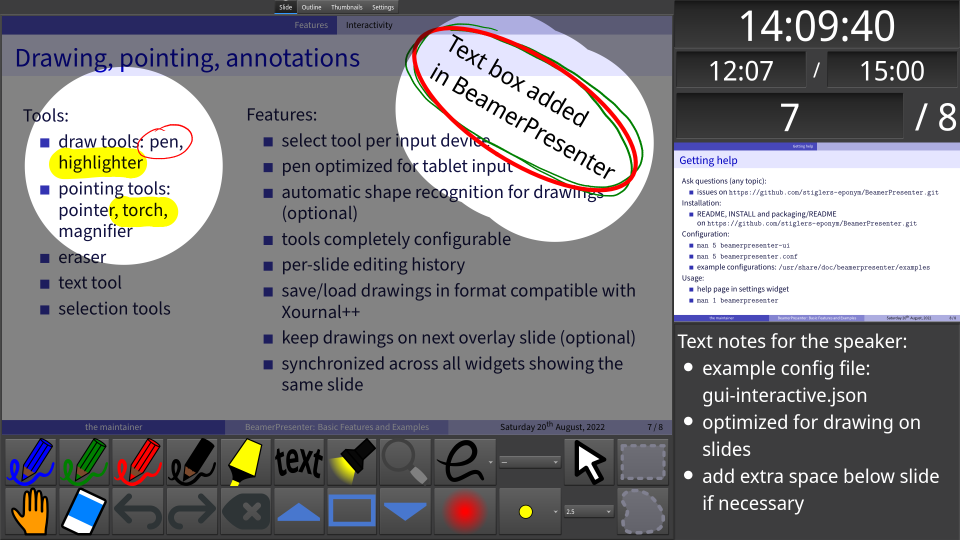

# BeamerPresenter
BeamerPresenter is a PDF viewer for presentations designed to show additional information to the speaker on a separate screen.
Multimedia content and tools for drawing/highlighting allow you to make the presentation interactive.
The modular user interface can show notes (text or separate PDF file), a timer, thumbnails of the slides etc.

This software uses the Qt framework and the PDF engines MuPDF or Poppler.

## Features (selection)
* modular user interface: adapt for your presentation style and technical equipment (number of monitors, required extra information for the speaker, input devices, ...)
* compressed cache for fast slide changes
* videos and slide transitions
* draw in slides, save drawings in a format compatible with [Xournal++](https://xournalpp.github.io)
* highlighting tools (pointer, torch, magnifier)
* rich text notes for the speaker
* (optionally) show separate presentation file for speaker or use LaTeX-beamer's option to show notes on second screen
* timer indicates progress relative to a predefined schedule by it's color
* navigate using document outline, thumbnail slides, page numbers/labels and links


## Screenshots
These screenshots show only a few examples how the speaker's screen can look. The audience sees only the presentation except if you specify something else.

<table border="0px" >
<tr>
<td width=50%>
Default configuration of the graphical interface with previews of the next slides:

</td>
<td>
Similar configuration with different Qt theme:

</td>
</tr>
<tr>
<td>
Speaker screen for example configuration gui-interactive.json, can be used e.g. for lectures.
Annotations can be saved in a format that is compatible with <a href="https://xournalpp.github.io">Xournal++</a>.

</td>
<td>
PDF documents can include videos, sounds, and slide transitions.

</td>
</tr>
</table>


## Installation
There exist different variants of BeamerPresenter:
You can choose the PDF engine (Poppler, MuPDF, or QtPDF) and the Qt version (≥5.9 or ≥6.2).
More details can be found in the [installation manual](https://github.com/stiglers-eponym/BeamerPresenter/blob/main/INSTALL.md).

Packages are available for Nix and in the AUR (for Arch/Manjaro).
The [releases](https://github.com/stiglers-eponym/BeamerPresenter/releases) come with packages for Arch/Manjaro/Endeavour, Ubuntu 20.04 / 22.04, and flatpak.
For example, the commands for installing BeamerPresenter with Poppler as PDF engine and Qt 5 after downloading the corresponding file are:
```sh
# Ubuntu 20.04:
sudo apt install ./beamerpresenter-poppler-0.2.3-qt5-focal-x86_64.deb
# Ubuntu 22.04:
sudo apt install ./beamerpresenter-poppler-0.2.3-qt5-jammy-x86_64.deb
# Arch/Manjaro:
sudo pacman -U beamerpresenter-poppler-qt5-0.2.3-1-x86_64.pkg.tar.zst
# Flatpak:
flatpak install org.kde.Platform/x86_64/5.15-21.08 # can be skipped if already installed
flatpak install beamerpresenter.flatpak
```
The build process for these packages is explained [here](https://github.com/stiglers-eponym/BeamerPresenter/tree/main/packaging).
Verify the signature of the checksums in `SHA256SUMS`:
```sh
gpg --keyserver hkps://keyserver.ubuntu.com --recv-keys DD11316A0D8E585F
gpg --verify SHA256SUMS.sig SHA256SUMS
```

In Arch Linux/Manjaro/Endeavour Linux you can also install one of the AUR packages [beamerpresenter](https://aur.archlinux.org/packages/beamerpresenter) and [beamerpresenter-git](https://aur.archlinux.org/packages/beamerpresenter-git).
Note that in these packages by default MuPDF is selected as PDF engine. The PKGBUILD file can be edited to use Poppler instead.

When using [Nix](https://nixos.org) you can install the latest release with
```sh
nix-env -iA nixos.beamerpresenter    # on NixOS
nix-env -iA nixpkgs.beamerpresenter  # on non-NixOS
```

The libraries required to build BeamerPresenter are also available on other platforms (see [installation manual](https://github.com/stiglers-eponym/BeamerPresenter/blob/main/INSTALL.md)).
Issues or pull requests concerning building on any platform are welcome!


## Configuration
There are two different aspects of the configuration:

### Program settings
Settings for the program are configured in the configuration file
`beamerpresenter.conf` as documented in `man 5 beamerpresenter.conf`. Most of
these settings can also be changed in the settings widget in the graphical
interface, but some settings require a restart of the program.

Some program settings can be temporarily overwritten using command line
arguments (documented in `beamerpresenter --help` or `man 1 beamerpresenter`).

### User interface
The user interface is configured in a separate JSON file (GUI config, `gui.json`) as
documented in `man 5 beamerpresenter-ui`. This file cannot be edited in the
graphical interface.
Example configurations are usually installed in `/usr/share/doc/beamerpresenter/examples`.

The GUI config defines which widgets are shown, including the number of windows,
tool buttons, notes for the speaker, combination of different PDF files, and
various other settings. A GUI config file can be selected temporarily with the
command line option `-g <file>`.


## Bugs and known problems
If you find bugs or have suggestions for improvements, please
[open an issue](https://github.com/stiglers-eponym/BeamerPresenter/issues).

When reporting bugs, please include the version string of BeamerPresenter
(`beamerpresenter --version`).

The following known problems have low priority. If one of these problems is relevant for you, please also open an issue.
* Multimedia
    * In Arch Linux the media player regularly hangs up when using qt6-multimedia-gstreamer. With qt6-multimedia-ffmpeg it should work.
    * Sounds included as sound link (not sound annotation) are unsupported when using MuPDF (this affects LaTeX beamer's `\sound` command; workaround: use `\movie` instead).
* Changing tool buttons via the user interface is non-permanent. Permanent changes in the user interface require manual changes in the JSON-formatted configuration file.
* If a preview shows specific overlays, slide changes adding or removing synchronization of this preview with another widget may lead to short flickering. Slide transitions during such slide changes can contain some ugly artifacts.
* When compiling with both MuPDF and Poppler, opening some PDF files with renderer=poppler can result in a segmentation fault (when loading the document or when rendering a certain page). It is recommended to compile with only one PDF engine.


## License
This software may be redistributed and/or modified under the terms of the GNU Affero General Public License (AGPL), version 3, available on the [GNU web site](https://www.gnu.org/licenses/agpl-3.0.html). Compiled versions of this program depend on or include components licensed under the GPL and other free software licenses. More details about the license can be found in the LICENSE file.

BeamerPresenter can be compiled without MuPDF, using only Poppler as a PDF engine.
When not using MuPDF in any way, this software may, alternatively to the AGPL, be redistributed and/or modified under the terms of the GNU General Public License (GPL), version 3 or any later version, available on the [GNU web site](https://www.gnu.org/licenses/gpl-3.0.html).

BeamerPresenter is distributed in the hope that it will be useful,
but WITHOUT ANY WARRANTY; without even the implied warranty of
MERCHANTABILITY or FITNESS FOR A PARTICULAR PURPOSE. See the
[GNU General Public License](https://www.gnu.org/licenses/gpl-3.0.html) for more details.
