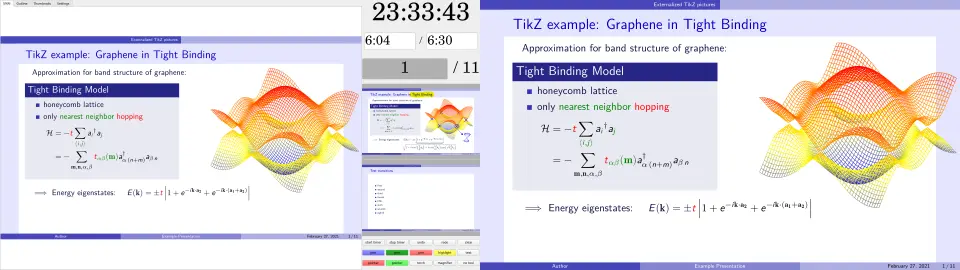
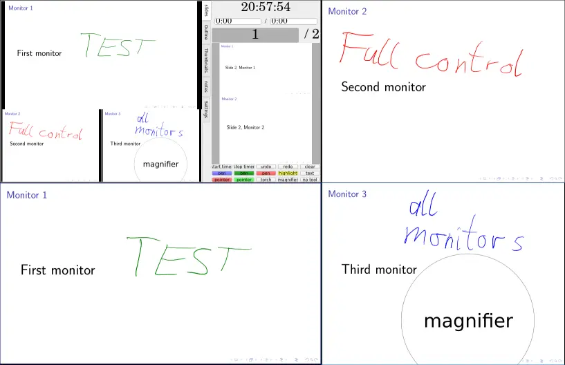

# BeamerPresenter
BeamerPresenter is a PDF viewer for presentations, which opens a presentation
screen and a control screen in two different windows. The control screen
optionally shows slides from a dedicated notes document instead of the slides
for the audience. Additional information on the control screen includes a
clock, a timer for the presentation, and previews of the next slides.

This software uses the Qt framework and the PDF engines MuPDF and/or poppler.

## Which version?
Versions [0.1](https://github.com/stiglers-eponym/BeamerPresenter/tree/0.1.x) and 0.2 are different programs with incompatible configurations.
[Version 0.1.3](https://github.com/stiglers-eponym/BeamerPresenter/releases) is relatively stable, works in ubuntu 18.04 and can be [built in macOS](https://github.com/stiglers-eponym/BeamerPresenter/tree/0.1.x#building-in-macos) without manually adapting beamerpresenter.pro.
Version 0.2 has many new features and is much more flexible.
If you want to draw in the presentation using a tablet or drawing pad, or if you want to adapt the interface or use more than two monitors, you should version 0.2.

## Features (selection)
* modular user interface (new in 0.2): adapt for your presentation style and technical equipment (number of monitors, extra information for the speaker, input devices, ...)
* compressed cache for fast slide changes
* draw in slides, save drawings in a format compatible with Xournal++ (improved in 0.2)
* highlighting tools (pointer, torch, magnifier)
* rich text notes for the speaker (new in 0.2)
* (optionally) show separate presentation file for speaker or use LaTeX-beamer's option to show notes on second screen (split PDF pages into a part for the speaker and a part or the audience)
* timer indicates progress relative to a predefined schedule by it's color (improved in 0.2)
* navigate using document outline, thumbnail slides, page numbers/labels and links
* videos in presentations (currently sound is untested)
* slide transitions


## Screenshots
These screenshots only show one possible way of using BeamerPresenter. The speaker could also see a different presentation (with additional information), or editable notes.

One possible configuration of the graphical interface shows the previews of the last overlays of the current and next slide to the speaker:

The left half of these pictures shows the window visible only to the speaker and the right half shows the presentation. Both are independent windows.
These examples were created with the configuration `config/gui-2files.json`, which also works fine if just one presentation file is given.

Use a magnifier to show details of your figures (size and magnification factor can be adjusted):


Draw in your presentation using a pen or highlighter and focus on parts of your slide using a torch or a pointer:

Of course, this is just for demonstration an you will usually not use pointer and torch at the same time.
Annotations, notes and some file-specific settings can be saved and loaded to gzipped xml files in a format which aims at partial compatibility with Xournal++.

Use an overview of all slides (or all slides with separate slide labels, especially useful for presentations created with LaTeX beamer):


You can embed videos in your slides. Drawing and highlighting also works in the video.

Note the slider for the video on the speaker's screen.
Slide transitions may in some cases need to interrupt a video.

The interface is very flexible and can be adjusted to your needs. Also multiple monitors are possible. Example of 4 windows for 4 different monitors (3 for the audience, 1 for the speaker):
<div align="center">
  
</div>


## Build and install
**Note**: building and installing version 0.1.3 is described
[here](https://github.com/stiglers-eponym/BeamerPresenter/tree/0.1.x#build).

Building is tested in Arch Linux and in xubuntu 20.04.
Older versions of ubuntu are only compatible with version 0.1 of BeamerPresenter.

In Arch Linux you can install `beamerpresenter` or `beamerpresenter-git` from the AUR.
Note that in these packages by default MuPDF is selected as PDF engine.

First install the dependencies. You need Qt 5 including the multimedia module. Qt 6.2 is tested in a separate branch.
Additionally you need either the Qt 5 bindings of poppler or the MuPDF C bindings.

### Dependencies in Ubuntu 20.04
For Qt 5:
* `qt5-qmake`
* `qt5-default`
* `qtmultimedia5-dev`
* `libqt5multimedia5-plugins` (optional, for showing videos)

For poppler (optional, see [below](https://github.com/stiglers-eponym/BeamerPresenter#build)):
* `libpoppler-qt5-dev`: version 0.86.1 is tested. Versions below 0.70 are explicitly not supported, problems with newer versions might be fixed if reported in an issue on github.

For MuPDF (optional, see [below](https://github.com/stiglers-eponym/BeamerPresenter#build)):
* `libmupdf-dev` (only for building): MuPDF versions starting from 1.17 should work, version 1.12 or older is explicitly not supported.
* `libfreetype-dev`
* `libharfbuzz-dev`
* `libjpeg-dev`
* `libopenjp2-7-dev`
* `libjbig2dec0-dev`
* `libgumbo-dev` (for MuPDF 1.18, probably not for version 1.17)

Others:
* `zlib1g-dev`

### Dependencies in Arch Linux
For Qt 5:
* `qt5-multimedia` (depends on `qt5-base`, which is also required)

For poppler (optional, see [below](https://github.com/stiglers-eponym/BeamerPresenter#build)):
* `poppler-qt5`

For MuPDF (optional, see [below](https://github.com/stiglers-eponym/BeamerPresenter#build)):
* `libmupdf` (only for building)
* `jbig2dec`
* `openjpeg2`
* `gumbo-parser`

Optional, for showing videos:
* `gst-libav`
* `gst-plugins-good`

### Build
Download the sources: either the latest git version
```sh
git clone --depth 1 https://github.com/stiglers-eponym/BeamerPresenter.git
cd BeamerPresenter
```
or version 0.2.0
```sh
wget https://github.com/stiglers-eponym/BeamerPresenter/archive/v0.2.0.tar.gz
sha256sum -c - <<< "524a3509cafebf5ced7fad3bfb1c4b35267913baebd142885a74e029d37812e9 v0.2.0.tar.gz"
tar -xf v0.2.0.tar.gz
cd BeamerPresenter-0.2.0
```
On systems other than GNU+Linux you now need to configure libraries in
`beamerpresenter.pro`. Pull requests or issues with build instructions for
other systems are welcome!

When building you need to **define the PDF engine**.
Build with one of the following commands:
```sh
qmake RENDERER=mupdf && make
qmake RENDERER=poppler && make
```
If this fails and you have all dependencies installed, you should check your
Qt version (`qmake --version`). If you use 5.8 < qt < 6, you should
[open an issue](https://github.com/stiglers-eponym/BeamerPresenter/issues)
on github.
In older versions you may also open an issue, but it will probably not be fixed.

### Install
In GNU+Linux you can install BeamerPresenter with
```sh
make install
```

### Upgrade from version 0.1
The configuration files of versions 0.1 and 0.2 are incompatible.
When upgrading, you should move your configuration files of version 0.1 to some backup to avoid conflicts.


## Bugs
If you find bugs or have suggestions for improvements, please
[open an issue](https://github.com/stiglers-eponym/BeamerPresenter/issues).

When reporting bugs, please include the version string of BeamerPresenter
(`beamerpresenter --version`) or the Qt version if you have problems building
BeamerPresenter (`qmake --version`).

## Development

### Known problems
* Video lags when drawing on it. Sometimes this can be reduced by first making sure that the presentation window has focus and then pausing and playing the video.
* Videos show a short black frame between repetitions. This also appears when navigating to a page containing a video from a different slide than the slide before the video.
* Sound in videos is basically untested and currently has low priority. Feel free to open an issue if this is relevant for you.
* Tool buttons can be changed in the user interface, but these changes are not saved. Buttons are part of the user interface, which can only be changed (permanently) by editing the JSON-formatted configuration file.
* The undo/redo actions do not handle text annotations correctly. They only remove or create text fields. But when editing a text field the default keyboard shortcuts (CTRL+Z and CTRL+SHIFT+Z) can be used to undo/redo changes in the text. Deleting a text field by deleting its entire text cannot be undone.
* Slide labels are broken for encrypted PDFs when using MuPDF.
* When compiling with both MuPDF and poppler (`qmake RENDERER=both`), trying to open a PDF with renderer=poppler can result in a segmentation fault for some PDFs (when loading the document or when reaching a certain page). The reason might be a linkage problem with some color-space functions. It is recommended to compile with only one PDF engine.
* The detection of unsaved changes is quite unreliable. When closing BeamerPresenter you may sometimes see a warning of possibly unsaved changes although there are no unsaved changes. This warning is currently not shown when closing the window through the window manager. The warning can be avoided by using the action "quit unsafe" instead of "quit".
* Sometimes the slides are not automatically rendered to the correct size when resizing the window. Changing or updating the page should solve this problem.
* Some slide transitions need to stop videos. Fly slide transitions during videos can cause strange effects.
* Some slide transitions can show artifacts on preview slide widgets which only show the first or last overlay of a slide.
* Some slide transitions may have bad performance (low frame rate).
* if preview shows specific overlays, slide changes adding or removing synchronization of preview and an another frame may lead to short flickering


### Ideas for further development
* fix strange probabilistic crash at startup
* improve cache management and layout corrections: sometimes cache is not used correctly.
* cache slides even when size of slides varies (partially implemented)
* cache only required slides in previews showing specific overlays
* make layout more reliable
* multimedia: include audio files, test sound in videos
* tools to select and modify drawings
* option to insert extra slides for drawing
* improve keyboard shortcuts in other widgets than slide widget
* more icons for actions


## License
This software may be redistributed and/or modified under the terms of the GNU Affero General Public License (AGPL), version 3, available on the [GNU web site](https://www.gnu.org/licenses/agpl-3.0.html). This license is chosen in order to ensure compatibility with the software libraries used by BeamerPresenter, including Qt, MuPDF, and poppler.

BeamerPresenter can be compiled without including MuPDF, using only poppler as a PDF engine.
Those parts of the software which can be used without linking to MuPDF may, alternatively to the AGPL, be redistributed and/or modified under the terms of the GNU General Public License (GPL), version 3 or any later version, available on the [GNU web site](https://www.gnu.org/licenses/gpl-3.0.html).

BeamerPresenter is distributed in the hope that it will be useful,
but WITHOUT ANY WARRANTY; without even the implied warranty of
MERCHANTABILITY or FITNESS FOR A PARTICULAR PURPOSE. See the
GNU General Public License for more details.
